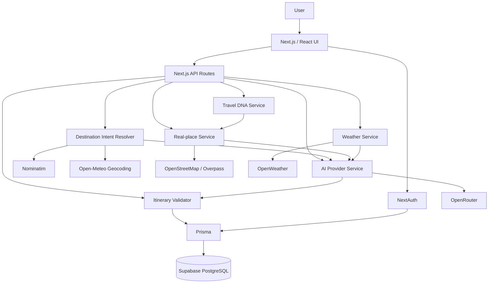
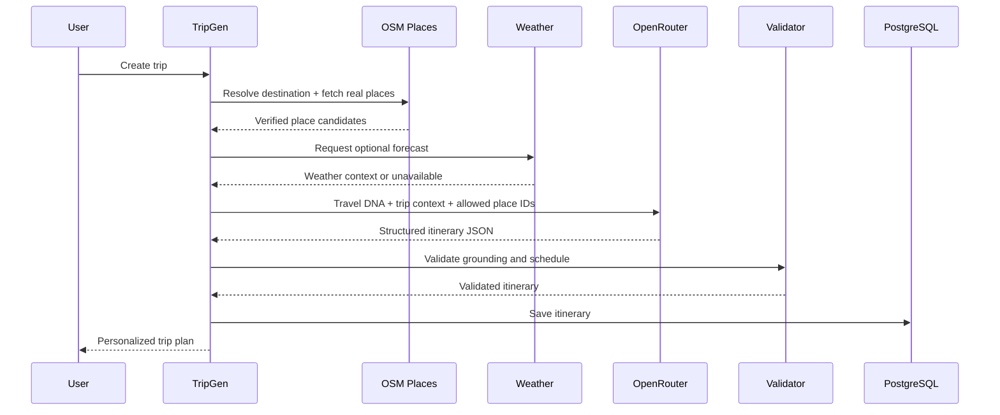

<div align="center">

# ✦ TripGen AI

### Adaptive travel intelligence, grounded in real places.

TripGen AI creates personalized, day-by-day travel plans from a traveler’s preferences, budget, destination and weather context — while grounding itinerary stops in verified OpenStreetMap place data.

<br />


<br />


</div>

---

## Overview

**TripGen AI** is a full-stack AI travel-planning platform built to make trip planning more personal, grounded and practical.

Instead of generating a generic list of attractions, TripGen first builds a **Travel DNA** profile for the user, discovers real places around the destination, considers weather and budget context, and then asks an AI model to construct an itinerary **using only the verified place candidates supplied by the system**.

The result is a travel plan that combines personalization, real-world data and conversational AI in one workflow.

### Core idea

```text
Traveler preferences
      ↓
Travel DNA profile
      ↓
Natural-language destination
      ↓
Verified real places
      ↓
Weather + budget context
      ↓
OpenRouter AI
      ↓
Grounded itinerary validation
      ↓
Saved personalized trip
```

---

## Features

- **Travel DNA personalization** — scores the traveler across eight preference dimensions.
- **Natural-language trip creation** — destinations can be entered conversationally rather than in a rigid format.
- **AI itinerary generation** — creates structured multi-day itineraries with OpenRouter.
- **Real-place grounding** — itinerary activities are selected from verified OpenStreetMap candidates instead of freely invented venues.
- **Geographic day clustering** — candidate places are grouped to reduce unnecessary back-and-forth travel.
- **AI Copilot** — ask questions about the trip or request itinerary changes in natural language.
- **Quick AI edits** — make a trip cheaper, add more local food, add more outdoor activities, or adapt the plan to weather.
- **Weather-aware planning** — optional OpenWeather forecasts can influence activity selection without blocking itinerary generation when weather is unavailable.
- **Budget awareness** — itinerary estimates and warnings help compare planned activity spend with the trip budget.
- **Itinerary validation** — checks grounding, duplicate places, coordinates, time formatting, sequencing and large geographic jumps.
- **Secure user accounts** — credentials authentication with per-user trip ownership.
- **Persistent trip storage** — users, Travel DNA profiles and trips are stored in PostgreSQL through Prisma.
- **Responsive premium UI** — animated glass-style interface built with Tailwind CSS and Framer Motion.
- **Safe AI fallback** — if AI generation is unavailable, TripGen can still construct an itinerary from verified real places rather than inventing locations.

---

## Travel DNA

Travel DNA is TripGen’s personalization layer. The quiz converts user choices into a profile across eight travel dimensions:

| Dimension | What it represents |
|---|---|
| Adventure | Active, energetic and high-engagement experiences |
| Culture | Museums, heritage, architecture and cultural places |
| Food | Local dining and food-focused experiences |
| Nature | Parks, gardens, nature reserves and outdoor spaces |
| Photography | Scenic and visually interesting locations |
| Relaxation | Slower-paced and restorative experiences |
| Nightlife | Evening venues and nightlife preferences |
| Budget | Sensitivity to cost and value |

The strongest signals are used to rank destination places and influence itinerary generation.

---

## TripGen Copilot

TripGen includes a contextual AI assistant directly inside the trip page.

The Copilot receives the current trip context and can:

- Answer questions about the existing itinerary.
- Explain what to do first or how to improve the plan.
- Make the trip cheaper.
- Add more local-food experiences.
- Prioritize outdoor activities.
- Adapt the itinerary to weather.
- Apply custom natural-language edits to a saved itinerary.

The assistant uses **OpenRouter** as the AI provider. Trip data remains the source context for the conversation, while itinerary edits are validated before being saved.

---

## Real-place grounding

A central design goal of TripGen is to reduce invented travel recommendations.

TripGen uses a grounding pipeline:

1. Resolve the destination to geographic coordinates.
2. Retrieve nearby place candidates from OpenStreetMap data.
3. Rank places using Travel DNA and place metadata.
4. Build geographically coherent day candidate groups.
5. Send only those allowed place IDs to the AI.
6. Require the generated itinerary to reference those IDs.
7. Hydrate the AI output with trusted place coordinates and metadata.
8. Validate the final itinerary before saving it.

The validator checks for:

- Unsupported or unknown place IDs.
- Duplicate places.
- Missing or invalid coordinates.
- Invalid time values.
- Chronological ordering issues.
- Large same-day jumps between activities.
- Significant activity-budget overruns.

If AI generation fails, the fallback itinerary is still built from the verified real-place set.

> **Important:** OpenStreetMap data can vary by destination, and cost values may be planning estimates when live admission prices are not present in the source data.

---

## Tech stack

| Layer | Technology |
|---|---|
| Framework | Next.js 16 App Router |
| UI | React 19, TypeScript, Tailwind CSS 4 |
| Motion | Framer Motion |
| Icons | Lucide React |
| Authentication | NextAuth credentials flow |
| Validation | Zod |
| ORM | Prisma 7 |
| Database | PostgreSQL / Supabase |
| AI | OpenRouter |
| Real places | OpenStreetMap / Overpass API |
| Primary geocoding | Nominatim |
| Geocoding fallback | Open-Meteo Geocoding API |
| Weather | OpenWeather |
| Notifications | React Hot Toast |

---

## Architecture



### Grounded itinerary flow



---

## Getting started

### Prerequisites

Before running the project locally, install:

- Node.js and npm
- A PostgreSQL database or Supabase project
- An OpenRouter API key
- An OpenWeather API key if you want live weather data

### 1. Clone the repository

```bash
git clone YOUR_REPOSITORY_URL
cd tripgen-ai
```

### 2. Install dependencies

```bash
npm install
```

### 3. Create your environment file

**Windows PowerShell**

```powershell
Copy-Item .env.example .env
```

**macOS / Linux**

```bash
cp .env.example .env
```

Then replace the placeholders in `.env` with your own credentials.

### 4. Verify configuration

TripGen includes a small environment checker:

```bash
npm run doctor
```

### 5. Sync the database

```bash
npm run db:push
```

### 6. Start the development server

```bash
npm run dev
```

Open:

```text
http://localhost:3000
```

---

## Environment variables

Create `.env` from `.env.example`.

```env
# Database
DATABASE_URL="postgresql://..."

# Authentication
NEXTAUTH_SECRET="your-long-random-secret"
NEXTAUTH_URL="http://localhost:3000"

# OpenRouter
OPENROUTER_ENABLED="true"
OPENROUTER_API_KEY="your-openrouter-key"
OPENROUTER_BASE_URL="https://openrouter.ai/api/v1"
OPENROUTER_MODEL="openrouter/free"
OPENROUTER_TIMEOUT_MS="60000"
OPENROUTER_SITE_URL="http://localhost:3000"
OPENROUTER_APP_NAME="TripGen AI"

# Weather — optional
OPENWEATHER_API_KEY=""
WEATHER_TIMEOUT_MS="5000"

# Places / geocoding
PLACES_USER_AGENT="TripGenAI/1.0 (student travel planner)"
NOMINATIM_HOST="https://nominatim.openstreetmap.org"
GEOCODING_FALLBACK_URL="https://geocoding-api.open-meteo.com/v1/search"
OVERPASS_URL="https://overpass-api.de/api/interpreter"
OVERPASS_URLS=""
PLACES_RADIUS_METERS="20000"
PLACES_TIMEOUT_MS="10000"
```

| Variable | Required | Purpose |
|---|---:|---|
| `DATABASE_URL` | Yes | PostgreSQL / Supabase connection string |
| `NEXTAUTH_SECRET` | Yes | Signs authentication tokens and sessions |
| `NEXTAUTH_URL` | Yes | Base URL used by NextAuth |
| `OPENROUTER_ENABLED` | Yes | Enables or disables OpenRouter integration |
| `OPENROUTER_API_KEY` | Yes | OpenRouter authentication |
| `OPENROUTER_MODEL` | Yes | AI model or router used by TripGen |
| `OPENWEATHER_API_KEY` | No | Enables live weather context |
| `NOMINATIM_HOST` | Yes | Primary geocoding endpoint |
| `GEOCODING_FALLBACK_URL` | Yes | Fallback geocoding endpoint |
| `OVERPASS_URL` | Yes | OpenStreetMap place-data endpoint |

> Never commit `.env`, database passwords or API keys to GitHub.

---

## Database setup

TripGen uses PostgreSQL through Prisma.

For Supabase:

1. Create a Supabase project.
2. Open the database connection settings.
3. Copy a PostgreSQL connection string suitable for your environment.
4. Put it in `DATABASE_URL`.
5. If your password contains reserved URL characters, URL-encode them before placing the password inside the connection URI.
6. Run:

```bash
npm run db:push
```

The current schema stores three main entities:

```text
User
 ├── TravelDNA
 └── Trip[]
```

`Trip.itinerary` is stored as JSON so the generated itinerary can preserve day, activity, grounding and metadata structures.

Useful Prisma commands:

```bash
npm run db:generate
npm run db:push
npm run db:migrate
npm run db:studio
```

---

## Local development commands

| Command | Purpose |
|---|---|
| `npm run dev` | Start Next.js development server with webpack |
| `npm run build` | Create a production build |
| `npm start` | Start the production server |
| `npm run lint` | Run ESLint |
| `npm run check` | Run TypeScript checks and ESLint |
| `npm run doctor` | Check required environment configuration and OpenRouter connectivity |
| `npm run db:generate` | Generate Prisma Client |
| `npm run db:push` | Sync Prisma schema to the database |
| `npm run db:migrate` | Create/apply development migrations |
| `npm run db:studio` | Open Prisma Studio |

---

## Project structure

```text
tripgen-ai/
├── app/
│   ├── api/
│   │   ├── ai/
│   │   ├── assistant/
│   │   ├── auth/
│   │   ├── places/
│   │   ├── travel-dna/
│   │   ├── trips/
│   │   └── weather/
│   ├── dashboard/
│   ├── login/
│   ├── register/
│   ├── travel-dna/
│   └── trips/
├── components/
│   ├── landing/
│   ├── layout/
│   ├── travel-dna/
│   ├── trip/
│   └── ui/
├── hooks/
├── lib/
├── prisma/
│   └── schema.prisma
├── public/
├── scripts/
│   └── doctor.mjs
├── services/
│   ├── aiProviderService.ts
│   ├── aiService.ts
│   ├── budgetService.ts
│   ├── destinationIntentService.ts
│   ├── itineraryService.ts
│   ├── itineraryValidator.ts
│   ├── placeService.ts
│   ├── travelDNAService.ts
│   └── weatherService.ts
├── types/
├── .env.example
├── package.json
└── README.md
```

---

## Data safety and AI design

TripGen separates **AI creativity** from **real-world place identity**.

The language model can decide how to organize and describe a trip, but the final activity identity is tied back to the real-place allowlist. Coordinates, names and source metadata are hydrated from the place service instead of trusting the model to invent them.

This makes the system more resilient to one of the biggest problems in AI travel planning: plausible-sounding but nonexistent recommendations.

The application also scopes trip reads and updates to the authenticated user.

---

## Known limitations

TripGen is currently a strong portfolio / academic project, but it is not a full commercial booking platform yet.

- Place coverage depends on OpenStreetMap data quality in each destination.
- Public Nominatim and Overpass services can be rate-limited or temporarily unavailable.
- Cost values may be planning estimates rather than live ticket or menu prices.
- The application does not claim real-time hotel, flight, restaurant or attraction booking availability.
- OpenRouter model availability and behavior can vary depending on the selected model/router.
- Weather data is optional and may be unavailable without a valid API key or network access.
- Interactive route maps, turn-by-turn routing and live transport-time calculations are not yet part of the finished itinerary experience.
- Production-scale rate limiting, monitoring, automated testing and deployment hardening can be expanded further.

---

## Roadmap

### Completed

- [x] Responsive Next.js application
- [x] User registration and authentication
- [x] Supabase/PostgreSQL persistence
- [x] Travel DNA quiz and traveler profile
- [x] Natural-language destination handling
- [x] OpenStreetMap real-place discovery
- [x] Geocoding with fallback support
- [x] Geographic day clustering
- [x] OpenRouter itinerary generation
- [x] Grounded place allowlist
- [x] Itinerary validation
- [x] Deterministic real-place fallback
- [x] Optional weather context
- [x] Budget-aware itinerary metadata
- [x] AI Copilot and itinerary editing
- [x] Premium responsive interface and motion system

### Next

- [ ] Interactive map with itinerary pins
- [ ] Real route distance and travel-time calculations
- [ ] Transport-mode recommendations
- [ ] Advanced trip-budget breakdown
- [ ] Before/after preview for AI itinerary edits
- [ ] Undo itinerary edits
- [ ] Trip sharing and collaboration
- [ ] Automated unit/integration/E2E testing
- [ ] API rate limiting and production monitoring
- [ ] Production deployment workflow
- [ ] Mobile client using the same backend

---

## Credits and data providers

TripGen AI is built with and/or integrates the following technologies and data services:

- **Next.js** — application framework
- **React** — user interface
- **TypeScript** — application language
- **Tailwind CSS** — styling system
- **Framer Motion** — interface animation
- **Prisma** — database ORM
- **PostgreSQL / Supabase** — persistent data storage
- **NextAuth** — authentication
- **OpenRouter** — AI model routing and inference
- **OpenStreetMap contributors** — place and geographic data
- **Overpass API** — OpenStreetMap place queries
- **Nominatim** — primary destination geocoding
- **Open-Meteo Geocoding API** — geocoding fallback
- **OpenWeather** — optional weather data
- **Lucide** — interface icons

OpenStreetMap-derived data should retain appropriate **© OpenStreetMap contributors** attribution wherever it is displayed or redistributed.

---

## License

This repository currently does **not** include an open-source license file.

Until a `LICENSE` file is added, the project should be treated as **all rights reserved** by its author. If the repository is intended to be openly reusable, add a license such as MIT before inviting redistribution or derivative use.

---

<div align="center">

### Built to make AI travel planning more personal, grounded and useful.

**TripGen AI — Adaptive Travel Intelligence**

</div>
